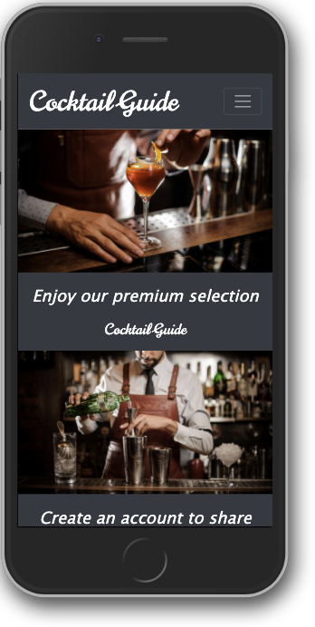

# COCKTAIL GUIDE

App about the world of cocktails. It contains a search engine that feeds on an API and a CRUD database in MongoDB Atlas with the users of the app and the recipes they can share with it.



## Starting 🚀

Instructions for getting a copy of the working project on your local machine for development and testing purposes.

### Requirements 📋

* Fork this repo.
* Clone this repo.

### Installation 🔧

Install all dependencies described in package.json:

```
$ npm install
```

Start your Express.js app at http://localhost:3000/

```
$ npm start
```

## Built with 🛠️

* [MongoDB Atlas](https://www.mongodb.com/cloud/atlas) - Multi-cloud database service for MongoDB.
* [Mongoose](https://mongoosejs.com/) - MongoDB object modeling for node.js.
* [Express](https://expressjs.com/) - Backend web application framework for Node.js.
* [Handlebars](https://handlebarsjs.com/) - To generate HTML from objects with data in JSON format.
* [Axios](https://www.npmjs.com/package/axios) - Promise based HTTP client for the browser and node.js.
* [Passport](https://www.npmjs.com/package/passport) - Authentication middleware for Node.js.
* [Bootstrap](https://getbootstrap.com/) - Front-end styles.
* [TheCocktailDB](https://www.thecocktaildb.com/api.php) - API for cocktails.
* [Heroku](https://www.heroku.com/) - For deployment.

## Author ✒️

* **Iván Urra** - [ivanurra](https://github.com/ivanurra)

## License 📄

© 2020 Copyright: Iván Urra.

Personal and non-commercial use.
